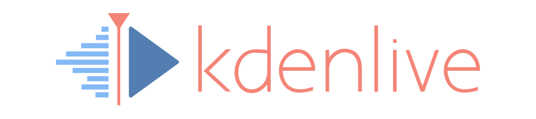

# About Kdenlive

[Kdenlive](https://kdenlive.org) is a Free and Open Source video editing application, based on MLT Framework and KDE Frameworks 6. It is distributed under the [GNU General Public License Version 3](https://www.gnu.org/licenses/gpl-3.0.en.html) or any later version that is accepted by the KDE project.

# Building from source

[Instructions to build Kdenlive](dev-docs/build.md) are available in the dev-docs folder.

# Testing Kdenlive via Nightly Builds

- AppImage (Linux): https://cdn.kde.org/ci-builds/multimedia/kdenlive/master/linux/
- Flatpak (Linux):
  - Add the kde flatpak repository (if not already done) by typing `flatpak remote-add --if-not-exists kdeapps --from https://distribute.kde.org/kdeapps.flatpakrepo` on a command line. (This step may be optional in your version of Flatpak.)
  - Install kdenlive nightly with `flatpak install kdeapps org.kde.kdenlive`.
  - Use `flatpak update` to update if the nightly is already installed.
  - _Attention! If you use the stable kdenlive flatpak already, the `*.desktop` file (e.g. responsible for start menu entry) is maybe replaced by the nightly (and vice versa). You can still run the stable version with `flatpak run org.kde.kdenlive/x86_64/stable` and the nightly with `flatpak run org.kde.kdenlive/x86_64/master` (replace `x86_64` by `aarch64` or `arm` depending on your system)_
- Windows: https://cdn.kde.org/ci-builds/multimedia/kdenlive/master/windows/
- macOS x86: https://cdn.kde.org/ci-builds/multimedia/kdenlive/master/macos-x86_64/
- macOS ARM: https://cdn.kde.org/ci-builds/multimedia/kdenlive/master/macos-arm64/

*Note * - nightly/daily builds are not meant to be used in production.*

# Contributing to Kdenlive

Please note that Kdenlive's Github repo is just a mirror: read [this explanation for more details](https://community.kde.org/Infrastructure/Github_Mirror). 

The prefered way of submitting patches is a merge request on the [KDE GitLab on invent.kde.org](https://invent.kde.org/-/ide/project/multimedia/kdenlive): if you are not familar with the process there is a [step by step instruction on how to submit a merge reqest in KDE context](https://community.kde.org/Infrastructure/GitLab#Submitting_a_Merge_Request).

We welcome all feedback and offers for help!

* Talk about us!
* [Report bugs](https://kdenlive.org/en/bug-reports/) you encounter (if not already done)
* Help other users [on the forum](http://forum.kde.org/viewforum.php?f=262) and bug tracker
* [Help to fill the manual](https://community.kde.org/Kdenlive/Workgroup/Documentation)
* Complete and check [application and documentation translation](http://l10n.kde.org)
* Prepare video tutorials (intro, special tricks...) in your language
  and send us a link to add in homepage or doc
* Detail improvement suggestions
  we don't test every (any?) other video editor, so give precise explanations
* Code! Help fixing bugs, improving usability, optimizing, porting...
  register on KDE infrastructure, study its guidelines, and pick from roadmap. See [here](dev-docs/contributing.md) for more information
